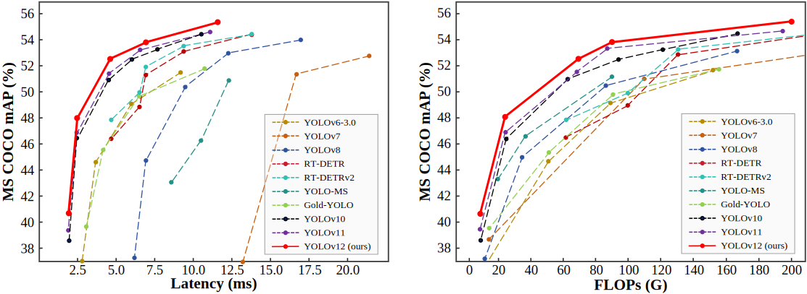
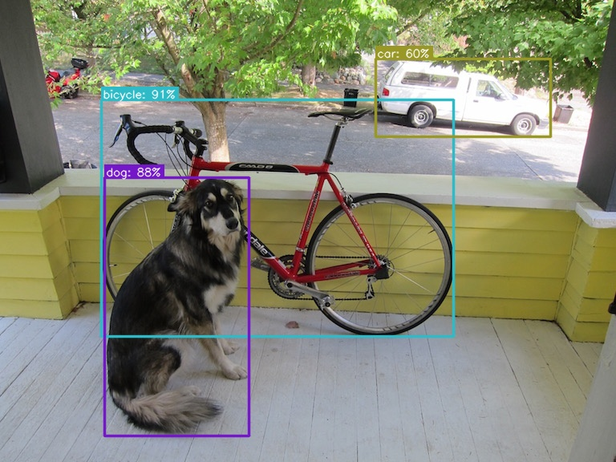
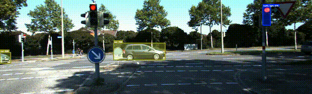

# YOLOv12 ONNX CPP


## Overview
This Project is a single C++ header with high-performance application designed for real-time object detection using The new YOLOV12 (You Only Look Once) model from [YOLOv12](https://github.com/sunsmarterjie/yolov12). Leveraging the power of [ONNX Runtime](https://github.com/microsoft/onnxruntime) and [OpenCV](https://opencv.org/), this project provides seamless integration with YOLOv12 implementation for image, video, and live camera inference. Whether you're developing for research, production, or hobbyist projects, this application offers flexibility and efficiency.


<p align="center">
   <br>
  Comparison with popular methods in terms of latency-accuracy (left) and FLOPs-accuracy (right) trade-offs
</p>


## Output

Below are examples of the output for both image and video inference:

<div align="center">
  <h3>Image Output</h3>
  
  
  <h3>Video Output</h3>
  
</div>


### Integration in your c++ projects

## Detection Example

```cpp

// Include necessary headers
#include <opencv2/opencv.hpp>
#include <iostream>
#include <string>
#include "YOLO12.hpp" 

int main(){

    // Configuration parameters
    const std::string labelsPath = "../models/coco.names";       // Path to class labels
    const std::string modelPath  = "../models/yolov12n.onnx";     // Path to YOLO12 model
    const std::string imagePath  = "../data/dogs.jpg";           // Path to input image
    bool isGPU = true;                                           // Set to false for CPU processing

    // Initialize the YOLO12 detector
    YOLO12Detector detector(modelPath, labelsPath, isGPU);

    // Load an image
    cv::Mat image = cv::imread(imagePath);

    // Perform object detection to get bboxs
    std::vector<Detection> detections = detector.detect(image);

    // Draw bounding boxes on the image
    detector.drawBoundingBoxMask(image, detections);

    // Display the annotated image
    cv::imshow("YOLO12 Detections", image);
    cv::waitKey(0); // Wait indefinitely until a key is pressed

    return 0;
}


```

> **Note:** For more usage, check the source files: [camera_inference.cpp](src/camera_inference.cpp), [image_inference.cpp](src/image_inference.cpp), [video_inference.cpp](src/video_inference.cpp).

## Features

- **ONNX Runtime Integration**: Leverages ONNX Runtime for optimized inference on both CPU and GPU, ensuring high performance.
  - **Dynamic Shapes Handling**: Adapts automatically to varying input sizes for improved versatility.
  - **Graph Optimization**: Enhances performance using model optimization with `ORT_ENABLE_ALL`.
  - **Execution Providers**: Configures sessions for CPU or GPU (e.g., `CUDAExecutionProvider` for GPU support).
  - **Input/Output Shape Management**: Manages dynamic input tensor shapes per model specifications.
  - **Optimized Memory Allocation**: Utilizes `Ort::MemoryInfo` for efficient memory management during tensor creation.
  - **Batch Processing**: Supports processing multiple images, currently focused on single-image input.
  - **Output Tensor Extraction**: Extracts output tensors dynamically for flexible result handling.

- **OpenCV Integration**: Uses OpenCV for image processing and rendering bounding boxes and labels.

- **Real-Time Inference**: Capable of processing images, videos, and live camera feeds instantly.

- **Easy-to-Use Scripts**: Includes shell scripts for straightforward building and running of different inference modes.


## Requirements

Before building the project, ensure that the following dependencies are installed on your system:

- **C++ Compiler**: Compatible with C++14 standard (e.g., `g++`, `clang++`, or MSVC).
- **CMake**: Version 3.0.0 or higher.
- **OpenCV**: Version 4.5.5 or higher.
- **ONNX Runtime**: Tested with version 1.16.3 and 1.19.2, backward compatibility [Installed and linked automatically during the build].

## Installation

### Clone Repository

First, clone the repository to your local machine:

```bash 
git clone https://github.com/mohamedsamirx/YOLOv12-ONNX-CPP.git
cd YOLOv12-ONNX-CPP
```

### Export The YOLOv12 model
** You can find The model weights in the models dir, But You can generate your own models On your local machine or using google colab like this [Google-Colab](https://colab.research.google.com/drive/1rtaWSaEsIJ4yc1eFbzT9kQ1cp23Aafr5?usp=drive_link).

**I have used the Roboflow installation for the flash attention.**

```bash 
git clone https://github.com/sunsmarterjie/yolov12
cd yolov12
pip install flash-attn --upgrade -q
pip install -r requirements.txt
pip install -e .
pip install --upgrade flash-attn
```
**Then run** 

```python 
from ultralytics import YOLO

model = YOLO('yolov12n.pt')
model.export(format="onnx", device = 'cpu')

```

### Configure

1. make sure you have opencv c++ installed
2. set the ONNX Runtime version you need e.g. ONNXRUNTIME_VERSION="1.16.3" in [build.sh](build.sh) to download ONNX Runtime headers also set GPU.

4. Optional: control the debugging and timing using [Config.hpp](tools/Config.hpp)


### Build the Project

Execute the build script to compile the project using CMake:

```bash
./build.sh
```

This script will download onnxruntime headers, create a build directory, configure the project, and compile the source code. Upon successful completion, the executable files (camera_inference, image_inference, video_inference) will be available in the build directory.

### Usage

After building the project, you can perform object detection on images, videos, or live camera feeds using the provided shell scripts.

#### Run Image Inference

To perform object detection on a single image:

```bash
./run_image.sh 
```

This command will process dog.jpg and display the output image with detected bounding boxes and labels.

#### Run Video Inference

To perform object detection on a video file:

```bash
./run_video.sh 
```

#### Run Camera Inference

To perform real-time object detection using a usb cam:

```bash
./run_camera.sh 
```

This command will activate your usb and display the video feed with real-time object detection.


**Class Names:**
- coco.names: Contains the list of class labels used by the models.

### License
This project is licensed under the GNU Affero General Public License v3.0 (AGPL-3.0). See the [LICENSE](LICENSE) file for details.

### Acknowledgment

- [https://github.com/Geekgineer/YOLOs-CPP/tree/main](https://github.com/Geekgineer/YOLOs-CPP/tree/main)
- [https://github.com/sunsmarterjie/yolov12](https://github.com/sunsmarterjie/yolov12)